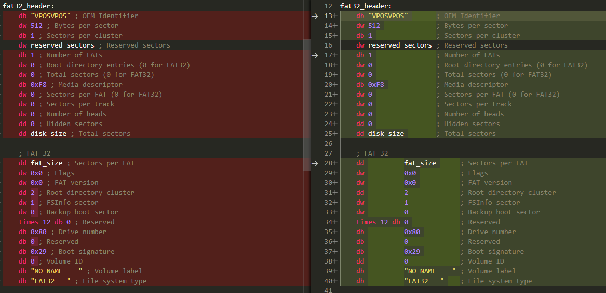
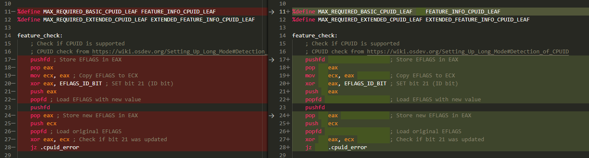
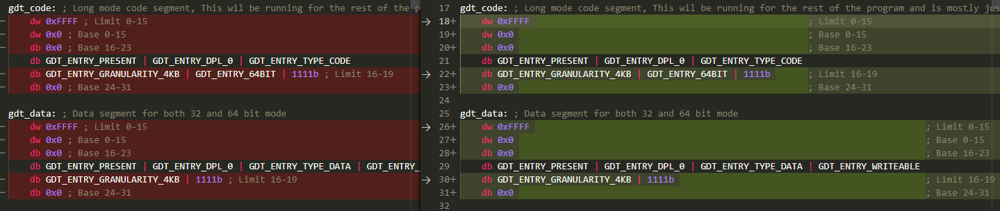
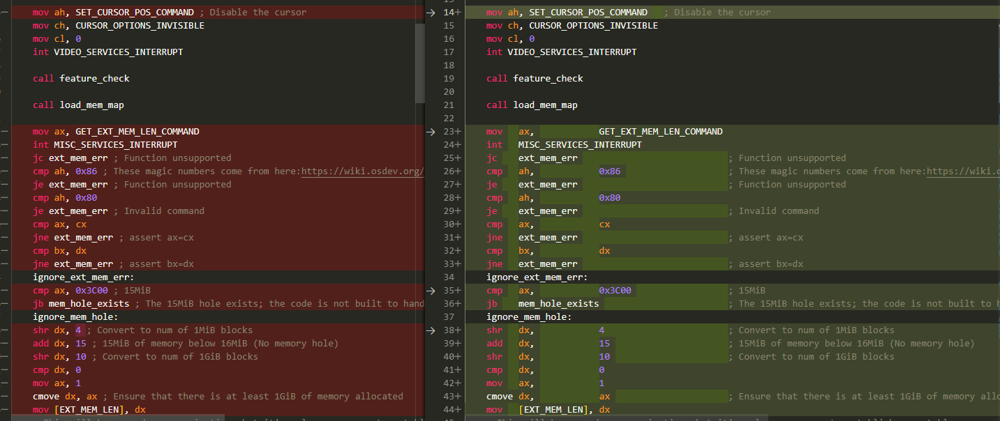

# asm-formatter README

Formats asm files. This extension is currently programmed to recognize languages with the ids "asm", "masm", "mips", and "nasm". I don't believe I set it up to provide any of language definitions itself. If there's some change that needs to be made here to increase compatibility, lmk or open a PR.

## Features

ASM is formatted using the following specification:

1. Statements that match `%define <something> <something else>` will align the spacing of `<something>` and `<something else>` to be the same as neighboring define statements.
2. Statements that match `[label] [times n] db/dw/dd/dq/equ <something>` will have the various parts of that statement aligned to be the same as neighboring lines.
3. Statements that match `<x86 instruction> <operands>` will be aligned (I think you get the idea).
4. Comments will be aligned (assuming they are on lines of the same type (from above))

## Example Diffs

## Known Issues

For `db/dw/dd/dq` statements, if there is no leading label or times statement, the `db/dw/dd/dq` will be aligned to the start of the line rather than with the neighboring statements. The rest of the line will still be aligned though. This is because if I indent them, the program can no longer tell that the line is on the same indentation level as the other lines. For an example of this bug, look at the third diff from above.

## Release Notes

### 1.0.0

Initial release of asm-formatter-coolspy3